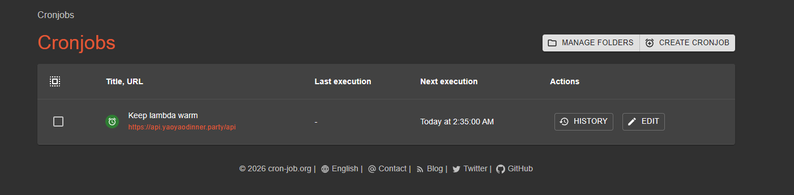

# Yaoyao Dinner

[](https://github.com/hatohui/yaoyao-functions/actions/workflows/backend-cd.yml)
[](https://github.com/hatohui/yaoyao-functions/actions/workflows/frontend-cd.yml)

## General Details

- API endpoint: [api.yaoyaodinner.party](https://api.yaoyaodinner.party)
- Frontend: [yaoyaodinner.party](https://yaoyaodinner.party)
- Runtime: AWS Lambda (serverless) — kept warm by a cron job pinging the health endpoint every 5 minutes
- Region: `ap-southeast-1`

## Architecture

A serverless web app split into three layers: static frontend (SPA), API (edge + Lambda), and media delivery (S3).

### Components

- **Frontend** — Static SPA on Cloudflare Pages; serves static assets and calls the API over HTTPS.
- **API** — CloudFront (with AWS WAF) → AWS Lambda (NestJS + TypeScript) in `ap-southeast-1`.
- **Datastores** — NeonDB (Postgres) for relational data; Upstash Redis for caching and fast KV.
- **Media** — Cloudflare R2 for uploads; backend issues presigned URLs and clients upload directly.
- **Warmup** — A cron job runs every 5 minutes to keep the Lambda warm and avoid cold starts.

### Design principles

- Separate delivery networks (Cloudflare Pages for frontend, CloudFront + WAF for API, S3 CDN for media) to minimize latency, reduce backend load, and simplify scaling.
- Direct client uploads to R2 via presigned URLs so media never proxies through the backend.
- Serverless Lambda with a warmup cron avoids provisioned concurrency costs while keeping response times acceptable.

### Diagrams




## Project Structure

```text
.
├── backend/               # API (NestJS + TypeScript)
│   ├── src/
│   │   ├── auth/          # JWT auth guards and strategies
│   │   ├── common/        # Shared utilities and decorators
│   │   ├── libs/          # Internal libraries (Prisma, Redis)
│   │   ├── modules/       # Feature modules
│   │   │   ├── account/
│   │   │   ├── category/
│   │   │   ├── feedback/
│   │   │   ├── food/
│   │   │   ├── health/
│   │   │   ├── images/
│   │   │   ├── language/
│   │   │   ├── order/
│   │   │   ├── people/
│   │   │   ├── personal-note/
│   │   │   ├── preset-menu/
│   │   │   └── table/
│   │   └── server/        # Lambda adapter and bootstrap
│   ├── prisma/            # Schema and migrations
│   ├── docker-compose.yaml
│   └── Dockerfile
├── frontend/              # Vite + React + TypeScript SPA
│   ├── src/
│   ├── public/
│   └── wrangler.toml      # Cloudflare Pages config
├── infra/                 # Terraform (Lambda, CloudFront, ECR, IAM)
├── docs/                  # Architecture diagrams and API reference
├── Taskfile.yml           # Dev task runner
└── README.md
```

## Prerequisites

- [Bun](https://bun.sh/) (package manager for both frontend and backend)
- Docker (for local Postgres, Redis, and MinIO)
- [Task](https://taskfile.dev/) — task runner (`task --list` to see all commands)

Optional (production infra):

- AWS CLI v2 configured for `ap-southeast-1`
- Terraform 1.5+
- Doppler CLI (secrets management)

## Getting Started

### 1. Clone and install

```bash
task setup
```

This installs frontend and backend dependencies, copies `.env.example` files, and initialises Terraform.

### 2. Configure environment variables

Edit `backend/.env` and `frontend/.env` with your local values. The `.env.example` files document every required variable.

### 3. Start local services

```bash
task backend        # starts Postgres, Redis, and MinIO via Docker Compose
```

The API runs outside Docker Compose. Start it separately after the services are up:

```bash
cd backend
bun run dev
```

### 4. Start the frontend dev server

```bash
task frontend       # or: task f
```

## Database

All schema changes are managed with Prisma.

| Command | Description |
| --- | --- |
| `task db:apply` | Apply pending migrations and regenerate the client |
| `task db:migrate NAME=<name>` | Create a new migration |
| `task db:seed` | Seed with initial data (idempotent) |
| `task db:reset` | Drop all tables and re-apply migrations |
| `task db:fresh` | Reset + seed |

## Redis

| Command | Description |
| --- | --- |
| `task redis:flush` | Flush all cache keys |
| `task redis:keys` | List all keys |

## Frontend

Vite + React + TypeScript SPA using Tailwind, GSAP, React Query, and i18n. Deployed to Cloudflare Pages.

```bash
cd frontend
bun install
bun run dev        # dev server
bun run build      # TypeScript check + production build → dist/
bun run preview    # preview the production build locally
```

Use `VITE_`-prefixed env vars for runtime configuration (e.g. `VITE_API_URL`). Production values live in `frontend/wrangler.toml` or your CI pipeline.

## Infrastructure

Terraform manages Lambda, CloudFront, ECR, and IAM. Secrets are injected at deploy time via Doppler.

```bash
task infra:apply    # doppler run — terraform apply
```

## API Reference

See [docs/api.md](docs/api.md) for the full endpoint list. A live Swagger/Scalar UI is served at `/api/docs` when the server is running.

## Key Environment Variables

| Variable | Description |
| --- | --- |
| `DATABASE_URL` | NeonDB (Postgres) connection string |
| `REDIS_URL` | Upstash Redis connection string |
| `CLOUDFLARE_API_TOKEN` | Cloudflare API token for R2 access |
| `CLOUDFLARE_ACCOUNT_ID` | Cloudflare account ID |
| `CLOUDFLARE_ACCESS_KEY_ID` | R2 access key (MinIO root user locally) |
| `CLOUDFLARE_SECRET_ACCESS_KEY` | R2 secret key (MinIO root password locally) |
| `BUCKET_NAME` | R2 / MinIO bucket name |
| `S3_ENDPOINT` | Override endpoint for local MinIO dev |
| `PORT` | API server port (default: `8080`) |
| `NODE_ENV` | `development` or `production` |
